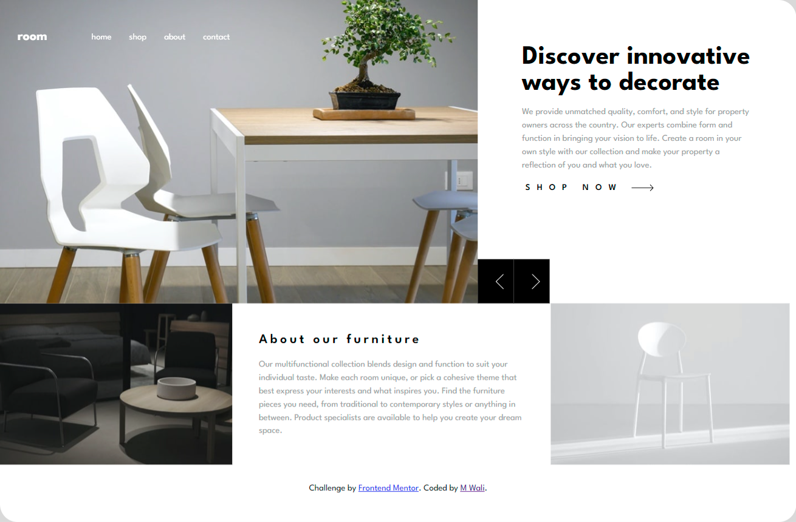
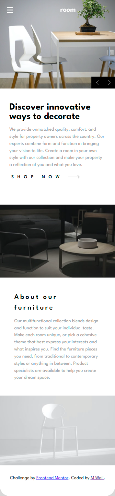

## Table of contents

- [Overview](#overview)
  - [The challenge](#the-challenge)
  - [Screenshot](#screenshot)
  - [Links](#links)
- [My process](#my-process)
  - [Built with](#built-with)
  - [What I learned](#what-i-learned)
- [Author](#author)

## Overview

[Thursday , March 2 24]

- Name: [Room-homepage-master]
- Develop With: [Reactjs]

### Screenshot

### Links

- Solution URL: [GitHub](https://github.com/Wali1209/room-homepage-master/)
- Live Site URL: [gh-pages](https://wali1209.github.io/room-homepage-master/)

## My process

- Creating empty React project with Vite
- Installing dependencies with NPM
- Add styling
- Make it responsive
- Add Routes to App using React-Router
- Build the project using npm run build
- push local Repo to the remote

### Built with

- CSS custom properties
- Mobile-first workflow
- [React](https://reactjs.org/) - JS library

### What I learned

- I Learned About React-Router

## Author

- [Portfolio](https://wali1209.github.io/personal-portfolio/)
- Frontend Mentor - [@Wali1209](https://www.frontendmentor.io/profile/Wali1209)
- GitHUB - [@Wali1209](https://github.com/Wali1209)
- Facebook - [Wali Hashmi](https://www.facebook.com/mdwali.hashmi.1/)
- LinkedIn - [Md Wali](https://www.linkedin.com/in/md-wali-154461189/)
